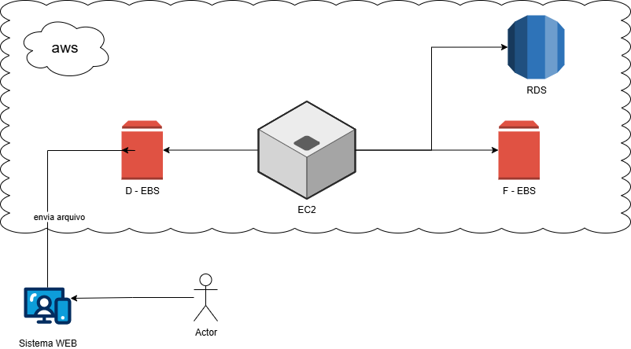
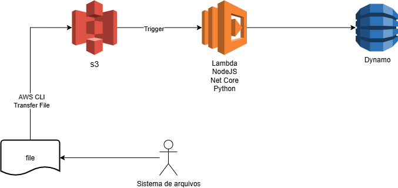

# AWS-EC2
Repositório criado como parte da avaliação do curso sobre AWS (Santander Code Girls) - módulo AWS-EC2

Anotações:
EC2 -> VM

EBS -> Armazenamento; "HD externo"; snapshot dos volumes

S3 -> Armazenamento; grandes volumes; 9,999999999% de disponibilidade; Glacier armazena quando > 90 dias

S3 + lambda function
EC2 + EBS

Instances -> General - Compute - Memory - Storage - Accelerated

Escalar verticalmente -> mesma instância; aumentar ou reduzir a capacidade

Escalar horizontalmente -> aumentar número de recursos

Iaas -> Responsabilidade maior do cliente (ingredientes crus de uma pizza)
Paas -> Responsabilidade intermediária (pizza congelada)
Saas -> Responsabilidade maior da empresa provedora (delivery)

EC2 + EBS

---

S3 + Lambda

